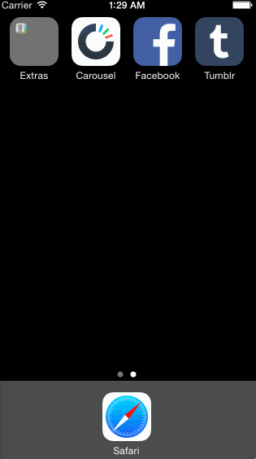

# Advanced Navigation (Tumblr)
Leveraging animations and gestures to create custom navigation.

#### Time spent
12 hours spent in total

#### Project requirements
- [x] Tapping on Home, Search, Account, or Trending should show the respective screen and highlight the tab bar button.
- [x] Compose button should modally present the compose screen.
- [x] Optional: Compose screen is faded in while the buttons animate in.
- [x] Optional: Login button should show animate the login form over the view controller.
- [x] Optional: Discover bubble should bob up and down unless the SearchViewController is tapped.

#### Notes
##### Setting iOS Status Bar Color
[CoderWall](https://coderwall.com/p/dyqrfa/customize-navigation-bar-appearance-with-swift) has a straightforward guide for programatically setting the status bar color in iOS, app-wide.

Start by setting the boolean property of `view controller-based status bar`  in  `info.plist` to `No`. Then define the color of status bar in `didFinishLaunchingWithOptions` function in `AppDelegate.swift` as:

```Swift
UIApplication.sharedApplication().statusBarStyle = UIStatusBarStyle.LightContent
```

iOS 7.0 and newer constants include:
```Swift
	UIStatusBarStyleLightContent
	# A light status bar, intended for use on dark backgrounds.
	
	UIStatusBarStyleDefault
	# A dark status bar, intended for use on light backgrounds.
```	
##### Discover Bubble Animation
I referenced classmate Scott Wong's code for to animate the discover bubble:
```Swift
        var exploreBubbleInitialY = exploreBubble.center.y
        UIView.animateWithDuration(1, delay: 0, options: .Repeat | .Autoreverse, animations: { () -> Void in
            self.exploreBubble.center.y = exploreBubbleInitialY + 5
            }) { (Bool) -> Void in
                //
        }
```
He was able to leverage some of the options of `animationWithDuration` to allow for call for both loops and repeatition. I used the same animation timing and travel, but adapted other declarations to my own writing style:
```Swift
        // set-up explore pop-up visibility and animation
        explorePopUp.alpha = 1
        explorePopUp.hidden = false
        var explorePopUpOrigin = explorePopUp.center.y
        UIView.animateWithDuration(1.0, delay: 0.0, options: .Repeat | .Autoreverse, animations: { () -> Void in
            self.explorePopUp.center.y = explorePopUpOrigin + 5
        }) { (Bool) -> Void in
        }
```

#### Walkthrough of all user stories


GIF created with [LiceCap](http://www.cockos.com/licecap/).

Change status bar color guide from [CoderWall](https://coderwall.com/p/dyqrfa/customize-navigation-bar-appearance-with-swift).
